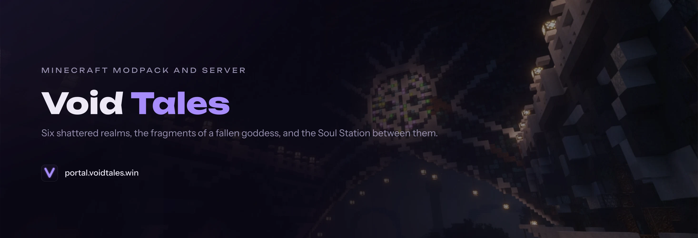

# Void Tales Portal ✨

A static Astro landing page for the Void Tales Minecraft community: full-bleed hero with live
server status, two sticky realm panels, a screenshot strip, the trailer, and the join steps.

No backend, no database, no runtime environment variables. The build produces plain HTML/CSS/JS served by nginx.

## Tech Stack

- [Astro 7](https://astro.build) — `output: 'static'`, no adapter
- [Tailwind CSS v4](https://tailwindcss.com) — CSS-first via `@tailwindcss/vite`, no `tailwind.config.js`
- Vanilla JS for interactivity (theme toggle, mobile menu, server status, copy button)
- No animation, carousel or UI library. Motion, the sticky stack and the screenshot strip
  are CSS (`position: sticky`, `scroll-snap`, `animation-timeline`)
- Astro Fonts API — Unbounded and Instrument Sans, self-hosted at build time
- pnpm

## Getting Started

Prerequisites: Node 22+ and pnpm.

```bash
pnpm install
pnpm run dev        # http://localhost:4321
```

## Scripts

| Command            | What it does                                  |
| ------------------ | --------------------------------------------- |
| `pnpm run dev`     | Dev server on :4321                           |
| `pnpm run build`   | `astro check` + `astro build` → `dist/`       |
| `pnpm run check`   | Type and template check only                  |
| `pnpm run preview` | Serve the production build locally            |
| `pnpm run test`    | Self-check for the MOTD parser                |
| `pnpm run format`  | Prettier over everything (`:check` to verify) |

There is no test framework. `astro check`, the production build and the MOTD parser
self-check are the gate.

## Project Structure

```
src/
  config/site.js         All copy, URLs and metadata — single source of truth
  config/navigation.js   Navigation links (rendered for desktop AND mobile)
  layouts/BaseLayout.astro   <head>, SEO tags, fonts, theme init, header + footer
  components/            Header, Footer, ServerStatus
  pages/index.astro      The landing page
  pages/404.astro        Error page
  styles/global.css      Tailwind import, @theme tokens, component classes
public/                  Images, favicon set, OG image, robots.txt, health.html
```

**Content lives in `src/config/site.js`** — never hard-code copy into components.

## Server Status

`ServerStatus.astro` queries [api.mcstatus.io](https://api.mcstatus.io) directly from the
browser (the API sends `access-control-allow-origin: *`, so no proxy is needed).

The MOTD keeps its colours: `src/utils/motd.ts` parses Minecraft's `§` codes from `motd.raw`
into plain data, and the component builds `<span>`s with `textContent` from it. Colours come
from a fixed table in the parser, never from the response. The API's `motd.html` is
deliberately unused — that would put third-party markup into the DOM.
Run `pnpm run test` for the parser's self-check.

Host and port are configured in `src/config/site.js`.

## Design tokens

Colours live as runtime variables (`--vt-*`) on `:root` and `html.dark`, and Tailwind's
utilities are hung on them through `@theme inline`. That is why `bg-raised`, `text-muted` and
`border-line` follow the theme on their own and there is no `dark:` colour pair in the markup.
The same token set powers the sister site, `voidtales-gallery`.

## Theme

Class-based dark mode. An inline script in `<head>` applies `.dark` to `<html>` before first
paint based on `localStorage.theme`, falling back to `prefers-color-scheme`. Which toggle icon
is visible is decided by CSS, so the button is correct without JavaScript.

## Deployment

Push to `main` builds a Docker image (`node:22-alpine` build stage → `nginx:alpine` serving
`dist/`) and triggers a Dokploy deployment.

The container listens on **port 80**.

## License

See [LICENSE](LICENSE).
